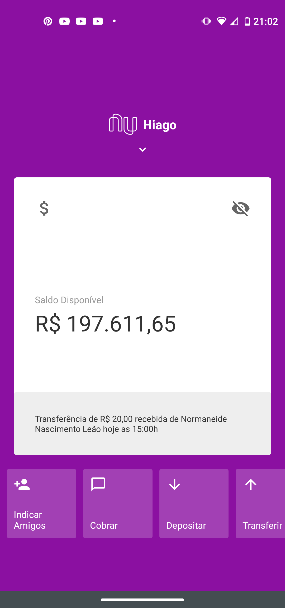
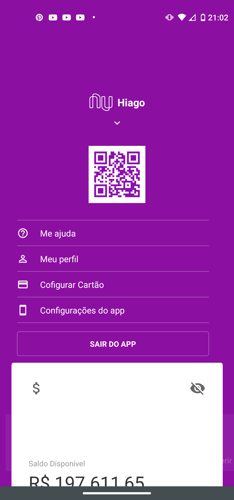
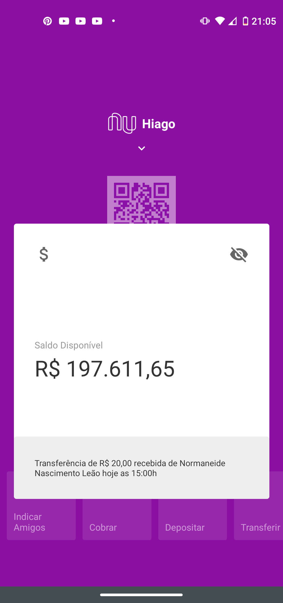

# Nubank Clone
Aplicativo react-native criado durante a aula "Clonando interface do Nubank" do canal da RocketSeat.

O que se destaca neste aplicativo são as animações que utilizam as bibliotecas Animated do react-native para lhe dar com as animações na tela e react-native-gesture-handler para lhe dar com os gestos feitos na tela do smartphone.

* Videoaula: https://www.youtube.com/watch?v=DDm0M_rZLJo&t=3778s

# Prints do aplicativo pronto

    
    
    

